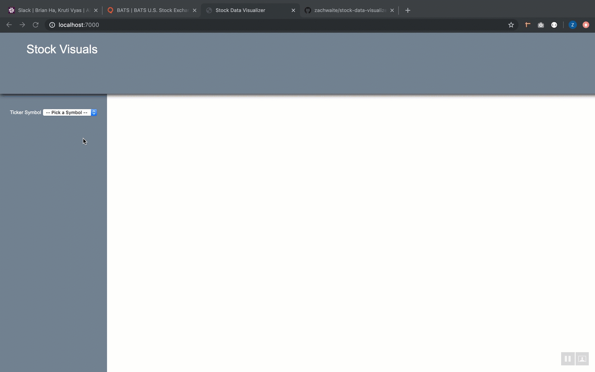

Stock Data Visualizer
=======================



## Intro

This app is a toy example of working with financial data in vanilla javascript. The
app sources data from two financial data API's 
and  as well as !(unsplash)[https://unsplash.com/].

### Features

* Configurable time series plots. Cascading controls are used to filter data
and generate the plot.
* Data point details on hover.
* Equity fundamentals lookup in the slide-in app drawer
* Skinnable. Pick your favorite color background.


## Setup

To run the app locally:

1. Get API keys from Quandl, US Fundamentals and Unsplash. They are free.


1. Clone this repo: `git clone https://github.com/javascriptFundamentalists/stock-data-visualizer`
2. Change into the project folder `cd stock-data-visualizer`
3. Install the dependencies `npm install`
4. Create a config.json file in the project root

```
{
  "QUANDL_API_KEY": "jsdkfsjl",
  "US_FUNDAMENTALS_API_KEY": "jsdkfsjl",
  "UNSPLASH_API_KEY": "s;dfjska;fjdkl;s",
}
```

5. Launch the app `npm run start`

## Technical Documentation

A Component pattern is available for dynamically building UI. A Component
is a section of UI, described with a template, that can have local state. Components
render automatically when the state changes. 

`lit-html` is used for templating and updating the DOM.

Different patterns can be used with Components. For example, one may prefer to
have the root Component manage all state, including I/O operations. In this case,
since data changes will cause children to update as needed, there is no need to
manage local state at the UI Component level. Alternatively, one may wish to
have a completely independent Component that operates asyncronously with the
rest of the app. This pattern is also supported and the component in
`src/components/FundamentalsComponent.js` demonstrate this technique.

### Declaring a component

```javascript
import { html } from 'lit-html';
import { Component } from './Component';


export class SideBarComponent extends Component {
  template (data) {
    return html`
      <div class="sidebar-section">
        <ul id="sidebar-list-1">
          <li><a id="data-1" href="#">Dataset 1</a>
          <li><a id="data-2" href="#">Dataset 2</a>
        </ul>
      </div>
    `;
  }

  events () {
    return [
      {type: 'click', selector: 'a', handler: this.triggerDataChange},
    ]
  }

  triggerDataChange(e) {
    e.preventDefault();
    const ds = e.target.id;
    this.triggerCustomEvent('data-change', {dataSet: ds})
  }

}
```

### Connecting Components within the UI

The Component constructor takes:

- data (object): this sets initial state, but might not be needed in child Components
- parentId (str): A string id of the DOM element to attach to. This can be null or otherwise falsey if attaching to a parent using the `children=[...]` argument.
- children (Array): An array of [Component, parentId] pairs. The parentId supplied here will prevail over an existing parentId on the Component instance.

```javascript
import "core-js/stable";
import "regenerator-runtime/runtime";

import "./style.scss";
import { AppComponent } from "./App";
import { D3Component } from "./D3Component";
import { SideBarComponent } from "./Sidebar";

const app = new AppComponent({name: 'World'}, 'root', [
  [new SideBarComponent({}, null, []), 'sidebar'],
  [new D3Component({}, null, []), 'content'],
]);

```

### Communication between components

Parent components can access directly the child widgets and their e.g. data and methods,
but developers should not add the inverse relationship (child knows it's parent).
Instead, custom events can be raised / listened to at the Component level.

```javascript
// use the triggerCustomEvent() method to notify listeners up the DOM
// e.g. to notify that a new ticker symbol has been selected
tickerInputChanged(e) {
  const ticker = e.currentTarget.value;
  this.triggerCustomEvent('update-ticker', {tickerSymbol: ticker});
}

// use the events() method on a listening component to register event listeners

events () {
  return [
    {type: 'update-ticker', selector: this.parentId, handler: this.updatePlot},
  ]
}

updatePlot (e) {
  const ticker = e.detail.tickerSymbol;
  axios.get(this.apiEndpoint).then(data => {
    const filteredData = data.filter(record => record.tradeDate >= this.startDate);
    this.update(filteredData);
  });
}

```

### Lifecyle Tricks

When using a subcomponent or some library that wants to take control of a
subsection of the component's DOM, it is sometimes necessary to do something
extra after the render or perhaps change the nature of the render altogether.
This can be done by either extending the `Component.render()` method via a
`super()` call or by using the `preMount()` or `postMount()` lifecycle methods.

```javascript

# this partial example from D3Component.js uses inheritance and extension
# note the super() call to perform the work of the base class before proceeding
...

  render(data, parentId) {
    super.render(data, parentId);

    if ( data.dataSet ) {

        // for BATS data
        if ( data.batsData ) {
          const rawDataArray = data.batsData.dataset.data;
          const parsedDataArray = rawDataArray.map(row => {
            return { date: row[0], close: row[1] };
          });
          data.plotData = parsedDataArray;
          this.clearPlot("#plot");
          this.renderPlot(data.plotData, "#plot", data.title);
        }
        ... more d3.js rendering

```


```javascript

# this example uses the postMount() lifecyle method to initialize the
# GlideJS carousel Component after the render of the main component, ensuring
# the <div class="glide" .../> exists to mount on

export class CarouselComponent extends Component {

  postMount () {
    this.glide = new Glide('.glide', {
      autoplay: 5000
    }).mount();
  }

  template (data) {
    return html`
      <div class="glide">
        <div class="glide__track" data-glide-el="track">
          <ul class="glide__slides">
            ${data.carouselUrls.map(
              url => html`
                <li class="glide__slide">
                  
                </li>
              `
            )};
          </ul>
        </div>
      </div>
    `;
  }
}
```

## What's up with the random image carousel?

This was a class project for the excellent 
program, and one of the criteria for acceptance was sourcing images from an api.
However, as it turns out, financial data is all about numbers and there aren't
any images that really fit besides the ones we make with D3... so, enjoy the
slideshow!

## Contributors

Zach Waite <zach@waiteperspectives.com>
Brian Ha <brianha32@gmail.com>
Kruti Vyas <vyasktruti89@gmail.com>
