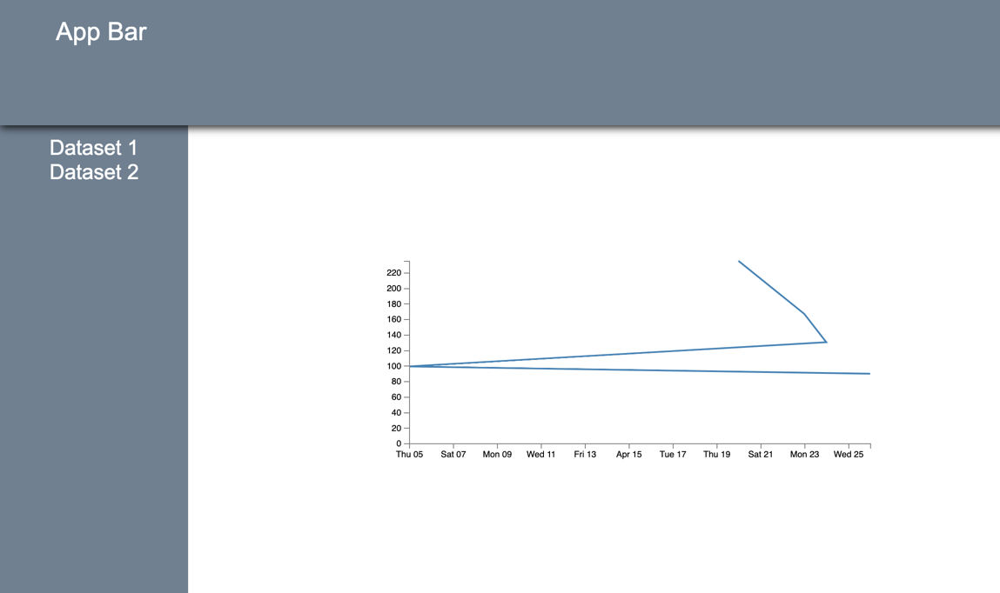

Stock Data Visualizer
=======================

## Intro



TODO: Summary of app

## Setup

To run the app locally:

1. Clone this repo: `git clone https://github.com/javascriptFundamentalists/stock-data-visualizer`
2. Change into the project folder `cd stock-data-visualizer`
3. Install the dependencies `npm install`
4. Launch the app `npm run start`

## Technical Documentation

A Component pattern is available for dynamically building UI. A Component
is a section of UI, described with a template, that have local state. Components
render automatically when the state changes. 

`lit-html` is used for templating and updating the DOM.

As of right now, the idea is to have the root Component manage all state,
including I/O operations. Since data changes will cause children to update
as needed, there is no real need to manage local state at the UI Component level.

### Declaring a component

```javascript
import { html } from 'lit-html';
import { Component } from './Component';


export class SideBarComponent extends Component {
  template (data) {
    return html`
      <div class="sidebar-section">
        <ul id="sidebar-list-1">
          <li><a id="data-1" href="#">Dataset 1</a>
          <li><a id="data-2" href="#">Dataset 2</a>
        </ul>
      </div>
    `;
  }

  events () {
    return [
      {type: 'click', selector: 'a', handler: this.triggerDataChange},
    ]
  }

  triggerDataChange(e) {
    e.preventDefault();
    const ds = e.target.id;
    this.triggerCustomEvent('data-change', {dataSet: ds})
  }

}
```

### Connecting Components within the UI

The Component constructor takes:

- data (object): this sets initial state, but might not be needed in child Components
- parentId (str): A string id of the DOM element to attach to. This can be null or otherwise falsey if attaching to a parent using the `children=[...]` argument.
- children (Array): An array of [Component, parentId] pairs. The parentId supplied here will prevail over an existing parentId on the Component instance.

````javascript
import "core-js/stable";
import "regenerator-runtime/runtime";

import "./style.scss";
import { AppComponent } from "./App";
import { D3Component } from "./D3Component";
import { SideBarComponent } from "./Sidebar";

const app = new AppComponent({name: 'World'}, 'root', [
  [new SideBarComponent({}, null, []), 'sidebar'],
  [new D3Component({}, null, []), 'content'],
]);

```

### Communication between components

Parent components can access directly the child widgets and their e.g. data and methods,
but developers should not add the inverse relationship (child knows it's parent).
Instead, custom events can be raised / listened to at the Component level.

```javascript
// use the triggerCustomEvent() method to notify listeners up the DOM
// e.g. to notify that a new ticker symbol has been selected
tickerInputChanged(e) {
  const ticker = e.currentTarget.value;
  this.triggerCustomEvent('update-ticker', {tickerSymbol: ticker});
}

// use the events() method on a listening component to register event listeners

events () {
  return [
    {type: 'update-ticker', selector: this.parentId, handler: this.updatePlot},
  ]
}

async updatePlot (e) {
  const ticker = e.detail.tickerSymbol;
  const data = await axios.get(this.apiEndpoint);
  const filteredData = data.filter(record => record.tradeDate >= this.startDate);
  this.update(filteredData);
}

```


